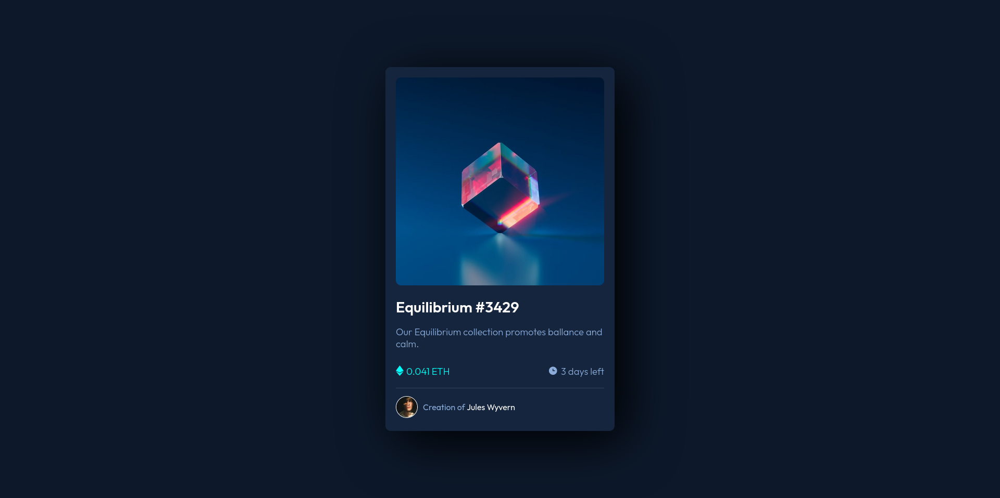

# Frontend Mentor - NFT preview card component solution

This is a solution to the [NFT preview card component challenge on Frontend Mentor](https://www.frontendmentor.io/challenges/nft-preview-card-component-SbdUL_w0U).

## Table of contents

- [Overview](#overview)
  - [The challenge](#the-challenge)
  - [Screenshot](#screenshot)
  - [Links](#links)
  - [Built with](#built-with)
  - [What I learned](#what-i-learned)
- [Author](#author)

## Overview

### The challenge

Users should be able to:

- View the optimal layout depending on their device's screen size
- See hover states for interactive elements

### Screenshot



### Links

- Solution URL: [Add solution URL here](https://your-solution-url.com)
- Live Site URL: [Github Page](https://Kaungwintshein.github.io/NFT-card-component-challenge/)

### Built with

- Semantic HTML5 markup
- CSS custom properties
- Flexbox
- CSS Grid
- Mobile-first workflow

### What I learned

```css
.main-img {
  position: relative;
}
.main-img::after {
  background: hsla(178, 100%, 50%, 0.5);
  content: url(images/icon-view.svg);
  position: absolute;
  inset: 0;
  display: flex;
  justify-content: center;
  align-items: center;
  opacity: 0;
  transition: all 0.5s ease;
  border-radius: 4%;
}
.main-img:hover::after {
  opacity: 1;
  cursor: pointer;
}
```

## Author

- Website - [Github](https://github.com/Kaungwintshein)
- Frontend Mentor - [@Kaungwintshein](https://www.frontendmentor.io/profile/Kaungwintshein)
